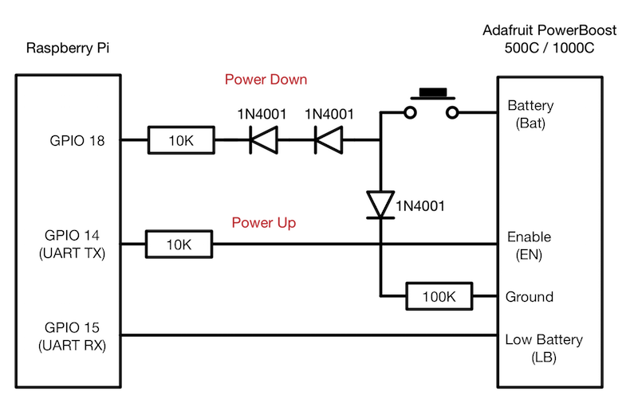
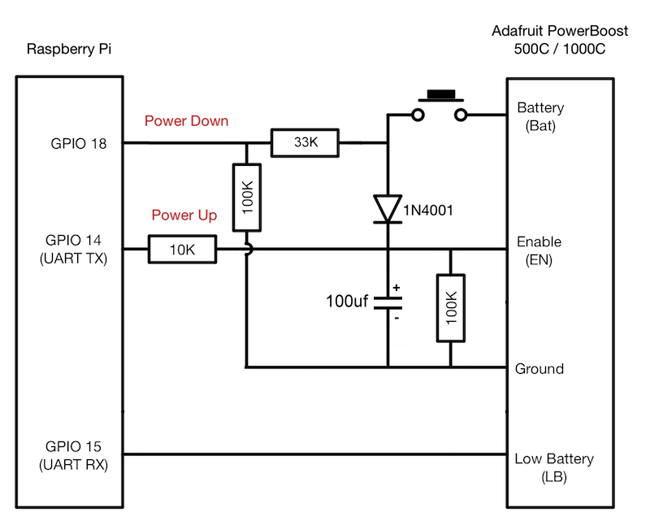
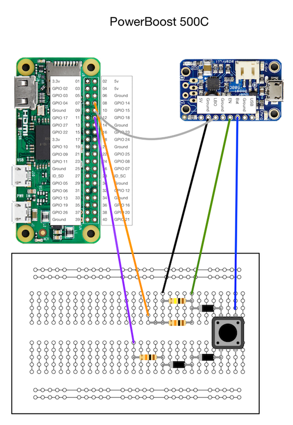
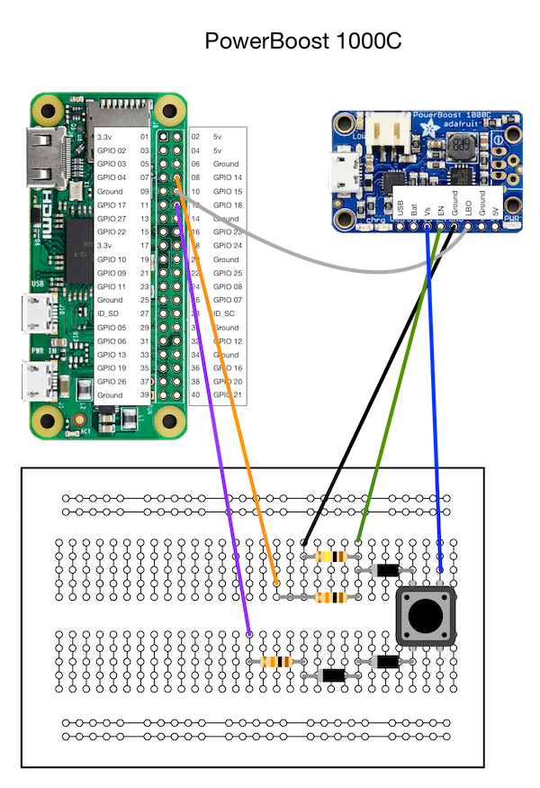

LiPoPi Power Up / Power Down version
======

This version builds on the original and allows the push button switch to both power up the Raspberry Pi,
as shown already, as well as trigger an orderly shutdown of the Pi when it is pressed once the Pi has booted.

This uses a Python script that is run as a service from *systemd*, the Linux init system that starts up certain processes when the system boots.

---

### How It Works



The Low Battery signal path is identical to the LiPoPi original and the Power Up path ony differs by the addition of a 1N4001 diode between
the switch and the Enable pin. This path relies on GPIO 14 being pulled high once the Pi is running. The diode prevents this from pulling GPIO 18 high.

The Power Down path pulls GPIO 18 high when the pushbutton switch is pressed. The Python script reacts to this trigger and initiates a system shutdown.

So what are the two 1N4001 diodes in series doing ? The Battery can have a voltage from around 4.7V when fully charged down to 3.2V when discharged.
But the Pi can only tolerate 3.3V on its GPIO pins. You could handle this using two resistors to create a voltage divider (e.g. 33K and 100K) but in our case we
the voltage drop inherent in diodes to lower this from 4.2V down to 2.8V (each 1N4001 has a forward voltage drop of around 0.7V).
This is close enough to 3.3V that it will trigger the GPIO pin without the risk of damage.

---

### A Simple Press (no hold) Power Up Version

I found that with the latest version of Raspbian that UART TX took a long time to stabilize and stay up - around 8 seconds. This required holding the power switch for at least that long. I needed a version of the circuit that only required a momentary press of the power switch to both power on and power off the Raspberry Pi. To solve this, we can add an RC network to hold EN high long enough to allow UART TX to remain high.



This version works much the same way as the earlier schematic with the following differences:

- The two diodes in the power down circuit are replaced with a resistive voltage divider. This actually reduces the component count because the 33K resistor provides the same current protection function as the 10K in the original design.

- A 100uf capacitor has been added that now creates an RC network in conjunction with the existing 100K pulldown resistor between EN and ground. You can vary the values of each component but be aware that changes to the resistor can affect its ability to function as a pull down resistor. If possible limit your changes to the value of the capacitor.

The 100uf capacitor and the 100K resistor provides a decay of around 10 seconds. This is both for power up and power down, resulting in the PowerBoost remaining powered up for about 8 seconds after the Pi shuts down. This doesn't have any effect on the Pi however, save for a miniscule amount of battery drain.

---

### Adafruit PowerBoost Charger 500C versus 1000C

LiPoPi works with both the [500C](https://www.adafruit.com/product/1944) and [1000C](https://www.adafruit.com/products/2465) PowerBoost Chargers from Adafruit.
There are, however, some important differences between the two devices.
The 1000C is capable of supplying up to 1000mA to Raspberry Pi whereas the 500C can (officially) supply up to 500mA - although Adafruit suggest you can pull more
than that in practice.

The other big difference is that the 1000C can supply power to the Pi directly from the USB input when the battery is discharged. In other words, when
connected to a USB input, it can power the Pi directly *and* charge up the attached battery. The charger component on the 500C can only charge the
battery.

This makes the 1000C the better choice for most Pi projects that you want to run from a LiPo battery. But do pay heed to the Adafruit warning about
the quality of USB power supply that you use:

> Just be aware that the charge rate is 1000mA max, and there's some inefficiency during the boosting stage, so make super sure that the USB adapter you're using to charge with is high quality, can supply 2A and has thick power wires. [This one from Adafruit](https://www.adafruit.com/product/1995) is ideal and has been tested, lower quality ones will not act well due to the voltage drop on the wires or droop on the power supply.

Standard USB cables us 28AWG wires - the 20AWG wires in the adafruit supply are more substantial. (No endorsement of Adafruit products over any other vendor is
implied - that just what has been used here)

Finally, the two boards look quite different as the pins are on opposite sides of the board. See the breadboard images below for more details.

With the 500C and 1000C the Battery voltage is measured from the BAT pin. The Vs pin on the 1000C will have the battery voltage when powered by the battery but this
will carry the USB voltage (5.2V) when the USB power cable is attached - this produces 3.8V after the diode voltage drops and this is too high for the 3.3V
limit for the GPIO pins on the Pi - so don't use this.

---

### Breadboard Layouts

This circuit has been tested with both the 500C and 1000C models of Adafruit PowerBoost Chargers.
The pin layout differs between the two boards and so two diagrams are shown here.






---

### lipopi.py

>NOTE - Before doing anything, be sure to run **sudo raspi-config** and under "Advanced Options" select "Serial" followed by "No".
>This prevents the Pi using GPIO 14 for the console (which would shut off the power).

>On newer versions of Raspbian, the menu options have changed - select "Interfacing Options" instead of "Advanced Options". Disable the serial console but DO NOT DISABLE THE SERIAL HARDWARE or UART TX will not stay high after power up.

>You may also need to edit your boot config by typing sudo nano /boot/config.txt and change enable_uart=0 to enable_uart=1

>Python on the Pi - if you do not have Python and the Rpi.GPIO library installed on your Pi then you will need to do the following

```bash
sudo apt-get update
sudo apt-get dist-upgrade

sudo apt-get install python-dev

sudo apt-get install python-setuptools
sudo easy_install rpi.gpio
```

This python script monitors the relevant GPIO pins for either a button press or a low battery signal from the PowerBoost and triggers a
safe shutdown of the Pi.

In addition, the script records the event in a log file (lipopi.log) and sends a system wide message to any logged in users via the 'wall' command.

The script is straightforward. Be sure to change the GPIO pin definitions if you want to use different pins.

The script sets up triggers with callback functions that are executed only when a change is detected on the GPIO pin.
This avoids having a script that continually polls the pins. There is a loop in the script but this simply calls 'sleep' and prevents
the script from exiting.

You might want to put the script in its own directory such as /home/pi/lipopi

You can run the script directly from the command line to test things out.

>NOTE - Be sure to test out any changes to the script on the command line, running with sudo, **before** you set it up using **systemd**.
>If you have a bug in the script that shuts down the Pi, it can be a real pain to fix - trust me...


---

### Setting up the Service with systemd

To have lipopi.py run automatically when you boot your machine, you can set up a service under the control of **systemd**.

1: Download lipopi.py and lipopi.service from this repository

2: Copy the service file to /etc/systemd

Modify the file **lipopi.service** to point to where your copy of **lipopi.py** is located, then

```bash
$ sudo cp lipopi.service /etc/systemd/system/.
```


3: Enable and start the service

```bash
$ sudo systemctl enable lipopi.service
$ sudo systemctl start  lipopi.service
```

There is no need to restart the Pi

4: Try it out

Push the button and the Pi should shut down. Push it again (for several seconds) and the Pi will boot up.

The log file will be written to /home/pi/lipopi - change this in the lipopi.py script if you want.


---

### UPDATE: Improved Circuit

Duncan has suggested the following version of the above circuit which improves on the 3v3 level control to the shutdown pin.

This should provide more stability as the battery level fluctuates.


See [this issue](https://github.com/NeonHorizon/lipopi/issues/54) for more information

